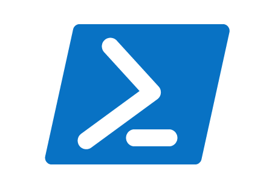

 

  

  <h3 align="center">PowerShell</h3>

  

    Some of my PowerShell scripts
     
     
    <a href="https://github.com/aleexolsson/PowerShell/issues">Report Bug</a>
    .
    <a href="https://github.com/aleexolsson/PowerShell/issues">Request Feature</a>
  

     

## Table Of Contents

* [About the Project](#about-the-project)
* [Built With](#built-with)
* [Getting Started](#getting-started)
  * [Prerequisites](#prerequisites)
  * [Installation](#installation)
* [Roadmap](#roadmap)
* [Contributing](#contributing)
* [License](#license)
* [Authors](#authors)
* [Acknowledgements](#acknowledgements)

## About The Project

This repository is just being used as a library for all my PowerShell scripts (or at least the ones that can be used outside of NDA's and such things)

Most of the scripts have been created using bits and bobs from various other scripts and then bodged together using ChatGPT.

## Built With

* [ChatGPT](https://chatgpt.com)
* [stackoverflow](https://stackoverflow.com)

## Getting Started

Getting started is very easy!
To get a local copy up and running follow these simple example steps.

### Prerequisites

* Clone the repository
* Modify the scripts to fit your use.

### Description

RemoveUser:
This Script removes a Windows user account from a computer by using the Remove-CimInstance command. It prompts the user to enter a username, asks a second time before removing the user account.

Apart from removing the user from the computer and removing the account folder from C:\Users\ there is also an option to remove a folder if you have a seperate folder with the users username.

Translate SID to Username:
This script is really simple that it prompts the user to enter a SID, and if that SID is found on the computer, then it translates it to a Windows username by using the System.Security.Principal.SecurityIdentifier command.

ADUserReport:
This script is used to export an excel-file containing Usernames, Description, AccountExpirationDates, WhenChanged and Enabled Status and also emails it to anyone. It requires some configuration to send an email.

ChangePrinterDriver:
This script was written for Citrix enviroments to change the driver of a printer for a specific user, enter the name of the printer apart from the sessionnumber, because it changes with each login. If the user dosen't have administrator priviliges, a service account with administrator priviliges needs to be created. Then a task in task scheduler needs to be created with user logon trigger and a 30 second delay.

ChangePrinter:
This script was also written for Citrix enviroments to change the standard printer upon login of a specific user, enter the name of the printer without the sessionnumber. And just like with the ChangePrinterDriver script, if the user doesn't have administrator priviliges, a service account with administrator priviliges needs to be created. Then a task in tas scheduler needs to be created with user login trigger and a 15-30 second delay.

RemoveOldFiles:
This script does exactly what the name suggests. It removes files in a folder older than X days. The only configuration it needs is the name of the folder it will be working in, as well as it needs a number for the max age of files in the folder at line 9.

DisableExpiredUsers:
This script is made to be put in Task Scheduler to be run every night, it's purpose is to disable user accounts when the accountExpires attribute (aka End Off) date has passed.(Because for some unknown reason, there is not any built-in functionalty for this.) There are two versions, the "-NoVerify" version does not verify that the disabled users actually are disabled after a set ammount of time. The configuration required before deploying is: Defining the log path at line 5, and making sure the account running the service can read the accountExpires attribute, as well as Write to the userAccountControl attribute, Copilot has put togheter a guide here:
1. Open ADUC
	* Launch Active Directory Users and Computers.
	* Right-click on the domain root (e.g., contoso.local) and select Delegate Control….
2. Start the Delegation Wizard
	* Click Next.
3. Add the User or Group
	* Click Add, select the account or group that should receive the permissions.
	* Click OK, then Next.
4. Choose "Create a custom task to delegate"
	* This option allows you to select specific objects and attributes.
	* Click Next.
5. Select Object Types
	* Choose Only the following objects in the folder.
	* Check User objects.
	* Click Next.
6. Select Permissions
	* Check Property-specific.
	* Scroll through the list and select:
		* Write userAccountControl (to disable accounts).
		* Read accountExpires (to read the account expiration date).
	* Click Next, then Finish.

## Roadmap

See the [open issues](https://github.com/aleexolsson/PowerShell/issues) for a list of proposed features (and known issues).

## Contributing

Contributions are what make the open source community such an amazing place to be learn, inspire, and create. Any contributions you make are **greatly appreciated**.
* If you have suggestions for adding or removing projects, feel free to [open an issue](https://github.com/aleexolsson/PowerShell/issues/new) to discuss it, or directly create a pull request after you edit the *README.md* file with necessary changes.
* Please make sure you check your spelling and grammar.
* Create individual PR for each suggestion.

### Creating A Pull Request

1. Fork the Project
2. Create your Feature Branch (`git checkout -b feature/AmazingFeature`)
3. Commit your Changes (`git commit -m 'Add some AmazingFeature'`)
4. Push to the Branch (`git push origin feature/AmazingFeature`)
5. Open a Pull Request

## License

Distributed under the MIT License. See [LICENSE](https://github.com/aleexolsson/PowerShell/blob/main/LICENSE.md) for more information.

## Authors

* **Shaan Khan** - [Shaan Khan](https://github.com/ShaanCoding/) - *Built ReadME Template*
* **Alex Olsson** - [Alex Olsson](https://github.com/aleexolsson/) - *Scriptwriter*

## Acknowledgements

* [ShaanCoding](https://github.com/ShaanCoding/)
* [Othneil Drew](https://github.com/othneildrew/Best-README-Template)
* [ImgShields](https://shields.io/)
